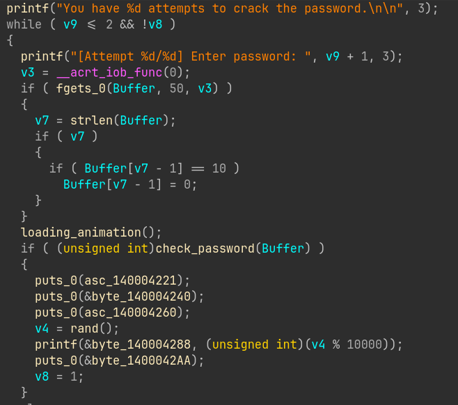
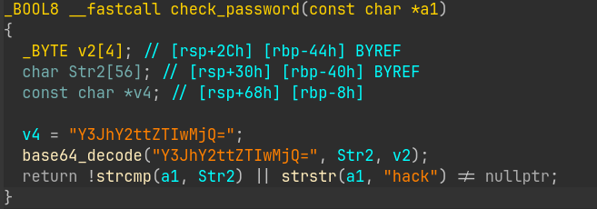
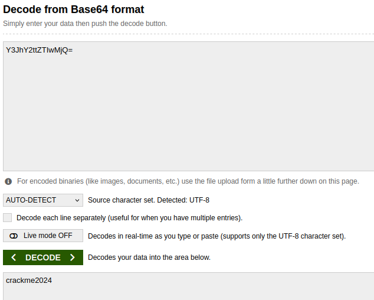
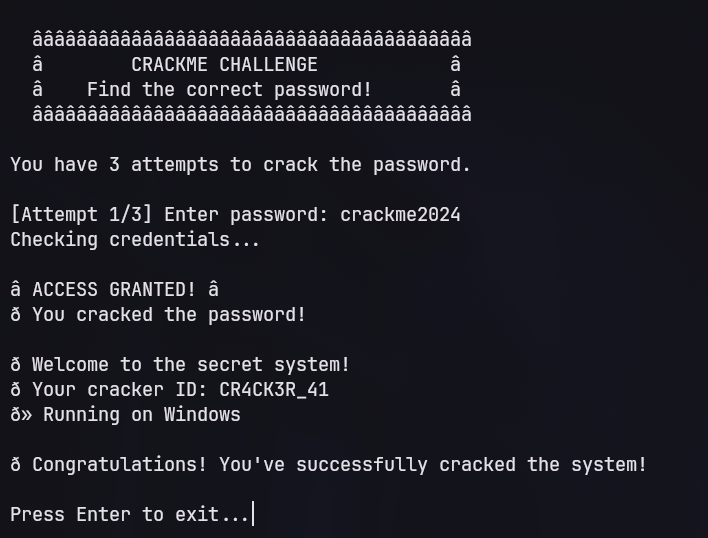
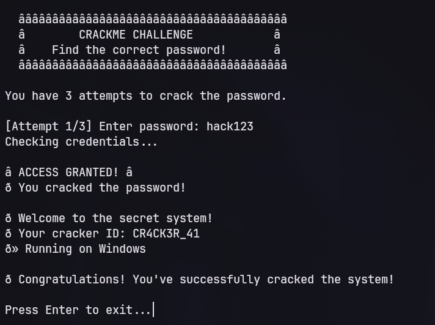

[Link to the crackme here.](https://crackmes.one/crackme/6a9281f948cda5a2aaa3dbf3)

`Description`
`A beginner-friendly crackme written in C. It simulates a simple terminal login prompt with a 3-attempt limit and a fake loading animation. Your goal is to bypass the security check and get the "ACCESS GRANTED" message.` 

`Goals`
1. `Primary Goal: Reverse engineer the binary to find the main password required to unlock the system.`
2. `Bonus Goal: Find the hidden backdoor string left behind by the developer.`
`Good luck, and happy reversing!`

This crackme is a basic Windows executable that asks for a password. This crackme was analyzed using IDA Professional 9.3.

Goal 1 asks us to reverse engineer the binary to find the main password required to unlock the system.

First, we look into `main()`:

The program gives the user 3 attempts to log in. After reading the input, it calls `check_password(Buffer)` (name assigned by IDA), which we then can look into:

Here we have a basic base-64 string, `Y3JhY2ttZTIwMjQ=`. We can use an external base-64 decoder, such as [base64decode.org](https://www.base64decode.org/) to convert this into a regular string:

The password is `crackme2024`. We can test this by running the program:

This is Goal 1 complete. We can now continue to Goal 2 -- find a hidden backdoor string left behind by the developer. We already saw this in the `check_password()` function:

Notice the second-last line:
`return !strcmp(a1, Str2) || strstr(a1, "hack") != nullptr;`
The first argument, `!strcmp(a1, Str2)` is not important (it checks if our password is correct). The second argument, `strstr(a1, "hack")` checks if the word `hack` appeared in the password and returns true if it has.  This would mean that any password containing the word `hack` would be treated as correct.

We can test this by running the program:

This holds true for all passwords that contain the word `hack`, such as `hack123`, `123hack`, or `ilovehacking`. This means `hack` is the backdoor for Goal 2, and that Goal 2 is now complete.